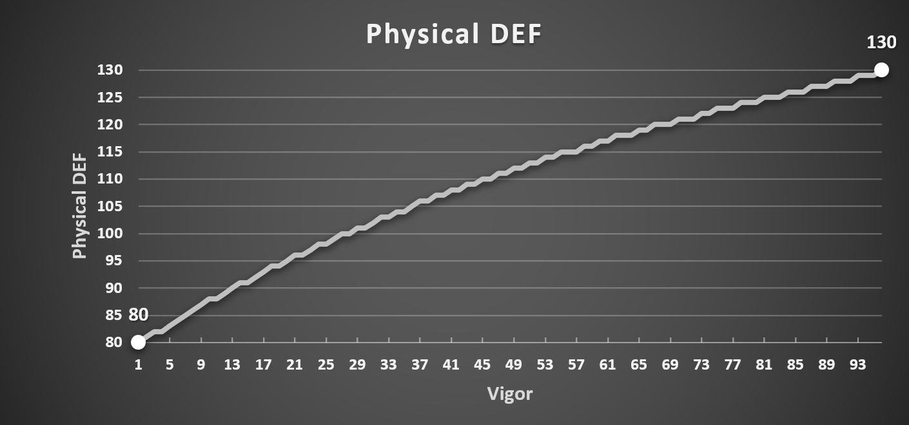
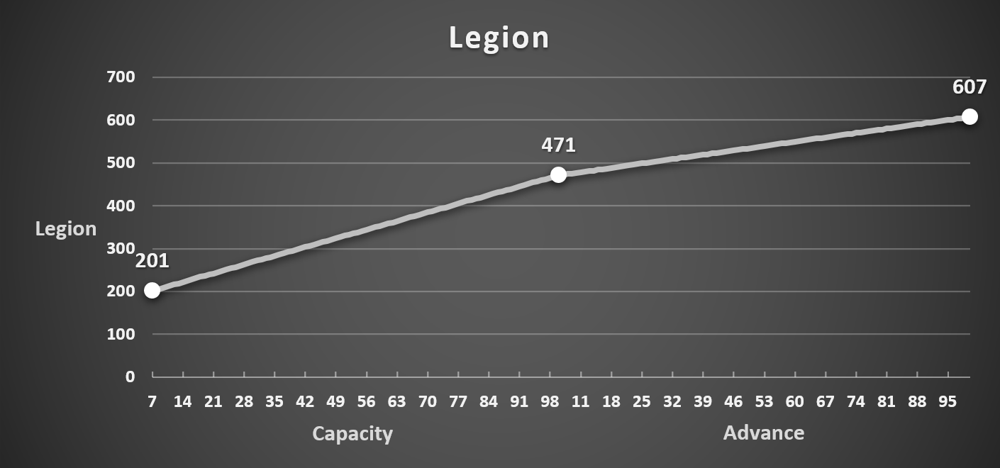

	<h2 align="center"><b>"Lies of P" Character Stats Analysis</b></h2>

	
	
	
	
	
	 
	
	
	 
   
	
	
	 
	
	
	
	 
	 
	
	
	
	
	
	
	 
	 
	</a>
	
	
	
	 
	

# Disclaimer

**THE DATA HAS BEEN OBTAINED FROM THE DEMO, THEREFORE, IT IS A SUBJECT TO CHANGES ONCE THE FULL RELEASE ARRIVES!**

# TL;DR

[TODO]

# Ergo Required

# Vitality

# Vigor

# Capacity

# Motivity

# Technique

# Advance

